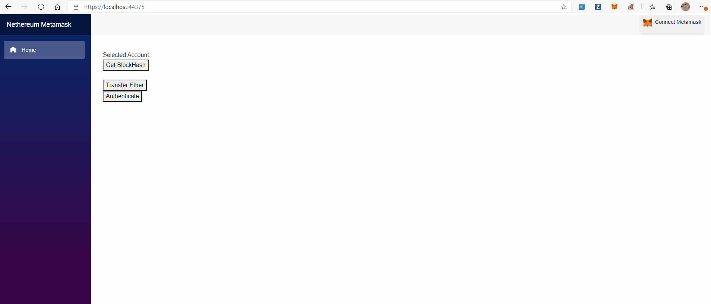

# Nethereum.Metamask.Blazor
Metamask + Nethereum + Blazor interop


```csharp
  bool MetamaskAvailable { get; set; }
    bool EthereumEnabled { get; set; }
    string SelectedAccount { get; set; }
    string BlockHash { get; set; }
    string TransactionHash { get; set; }
    string ErrorTransferMessage { get; set; }

    protected override async Task OnInitializedAsync()
    {
        MetamaskAvailable = await metamaskService.CheckMetamaskAvailability();
    }

    protected async Task EnableEthereumAsync()
    {
        EthereumEnabled = await metamaskService.EnableEthereumAsync();
        if (EthereumEnabled)
        {
            SelectedAccount = await metamaskService.GetSelectedAccount();
        }
    }

    protected async Task GetBlockHashAsync()
    {
        var web3 = new Nethereum.Web3.Web3();
        web3.Client.OverridingRequestInterceptor = metamaskInterceptor;
        var block = await web3.Eth.Blocks.GetBlockWithTransactionsByNumber.SendRequestAsync(new HexBigInteger(1));
        BlockHash = block.BlockHash;
    }

    protected async Task TransferEtherAsync()
    {
        try {
            var web3 = new Nethereum.Web3.Web3();
            web3.Client.OverridingRequestInterceptor = metamaskInterceptor;

            TransactionHash = await web3.Eth.GetEtherTransferService().TransferEtherAsync("0x13f022d72158410433cbd66f5dd8bf6d2d129924", 0.001m);
        }
        catch(Exception ex)
        {
            ErrorTransferMessage = ex.Message;
        }
    }

```
